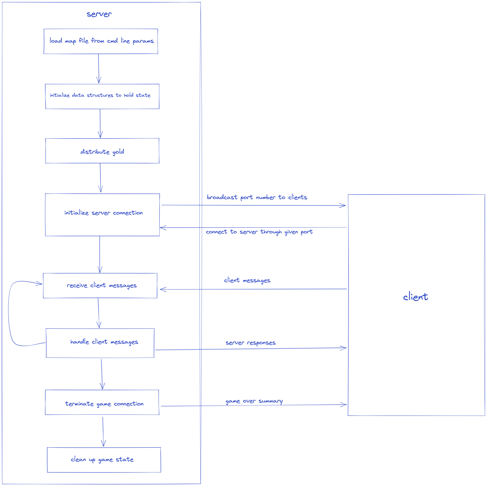
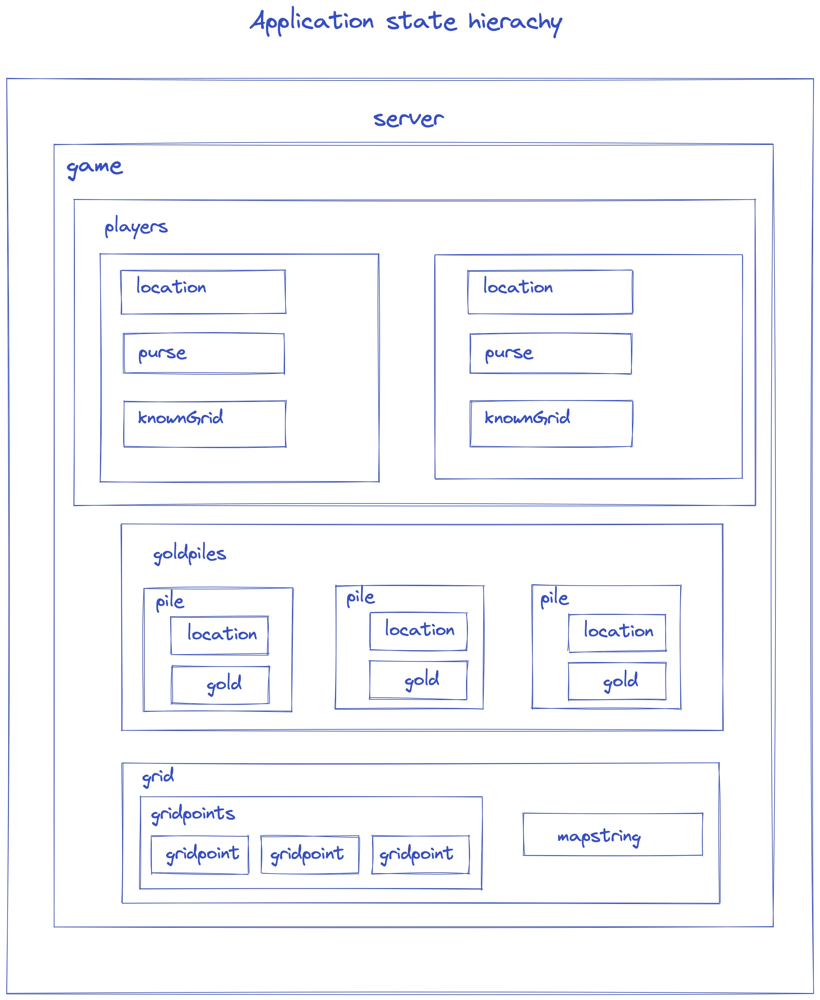

# Nuggets
## Design Spec

The Nuggets game requires two standalone programs: a client and a server.
We describe each module in the server separately.
We do not describe the `support` library nor the modules that enable features that go beyond the spec.

## Server
### User interface

An instance of the server is initiated by running the command below in the terminal.

`./server map.txt [seed]`

where `map.txt` parameter is the path to any of the valid map files provided in the `support` module and `seed` is an optional `int` parameter that can be used to replicate random behavior (useful for debugging).

### Inputs and outputs

*Inputs*
- map file - text file that contains the game's map.

*Outputs*
- the server logs output to stderr by default

- output can be redirected to a log file by passing one as a parameter when launching the server, e.g., `./server 2> server.log map.txt [seed]`

### Logic/algorithmic flow

The server will run as illustrated in this high-level workflow diagram:

	execute from a command line per the requirement spec
	parse the command line, validate parameters
	set up data structures
	load grid from map file parameter
	distribute gold to piles across the grid
	initialize the 'message' module and print the port number on which we wait
	call message_loop(), to await clients
		receive messages from the clients
		handle client messages
	call gameOver() to inform all clients the game has ended
	clean up

#### Functional decomposition
1. `validate_parameters` - inspect the command-line parameters passed and ensure they are valid

2. `distribute_gold` - deposits gold piles onto random spots on the game's grid

3. `add_player` - adds a player/spectator to the game.

4. `distribute_gold` - creates and randomly distributes the gold pile across the room spots in the game's grid.

5. `handle_message` - parses messages from the clients and responds appropriately.

## Modular decomposition

This next section briefly describes the structs included in the design to hold and manage the game's state in the server. Each struct is contained in its own module. The figure below illustrates how these structs organize the game's state.

> In addition to the methods listed for each struct below, each of them will have two additional methods, i.e., `{struct}_new` and `{struct}_delete` to initialize and erase the struct respectfully.

### Point module

Each grid point in the game is represented by this struct. It contains the following properties:

1. `int x`, `int y` - x and y coordinates

2. `char type` -  indicates whether a grid point is a room spot, solid rock or boundary

3. `char occupant` - the current entity present in the specified gridpoint.
Could be a player, a gold pile or empty.

#### Functional decomposition

1. `get_x, get_y` - getters for the grid point's coordinates. We assume that the point's coordinates (as well as type) will be set at initialization, with no need to modify them.

2. `get_occupant`, `set_occupant` - getter and setter for the gridpoint's occupant. Note that the occupants vary only in room spots.

---

### Pile module

This struct represents a pile of gold using the following properties:

1. `Point* location` - a pointer to the gold pile's coordinates.

2. `int gold` - the amount of gold in the pile.

#### Functional decomposition

1. `get_location` - getter for the pile's location. We assume the location is permanently set during gold distribution.

2. `get_gold` - getter for the gold contained in the pile. Similarly, we assume the amount is set during distribution.

### Grid module

The `grid` struct holds a representation of the game's map and its occupants. It contains:
1. `Points ** gridpoints` - an array containing each grid point in the game.

2. `char* mapString` - a representation of the game's map (including its occupants) in string format. This string is the most important part of the message that is sent to the client by the server each time the game's state changes.

#### Functional decomposition

1. `get_gridpoint` - given the coordinates of a grid point, return a pointer to that grid point object.

2. `build_grid` - given a map string, this function constructs the array of grid points.

3. `build_mapString` - given an array of grid points, this function will reconstruct the map string.

#### Major data structures

The grid will be represented using both an *array* of points and a *string.* Using the array makes it easy to access and modify each point in the map as needed. The string representation allows the map to be sent to the client and displayed efficiently.

---

### Player module

The `player` struct holds the state of a player or spectator in the game. This state will be represented using the following variables:

1. `char* name` - the name of the player.

2. `char letter` - a letter that is assigned to each player when they join the game, and is used to represent the player's position on the map.

3. `char type` - indicates whether the player is a spectator or participant in the game.

3. `Point* location` - the player's location on the map.

4. `int purse` - the amount of gold collected by the player.

5. `char* visibleGrid` - the section of the grid that is visible to the player.

6. `char* knownGrid` - the section of the grid that has been visited by the player, plus the `visibleGrid`. This represents the entire section of the grid that is displayed to a player.

#### Functional decomposition

1. `get_name`, `get_letter` - getters for the player's name and letter representation. Both of this variables are set when a player joins the game.

2. `get_location`, `set_location` - getter and setter for the player's location on the grid.

3. `get_gold` - return the amount of gold present in the player's purse.

4. `collect_gold` - provides the functionality for collecting gold from the gold piles.

5. `display_grid` - returns the section of the grid that is displayed to the player.

---

### Game module

This struct holds the overall state of the entire game. It will keep track of the game's grid, players and gold piles present in the game using the following variables:

1. `Pile** goldPiles` - an array containing all the piles of gold in the game.

2. `Player** players` - an array containing all the players in the game.

3. `Grid* grid` - the map of the game's maze.

---

## Player

> To be implemented at a later stage. For now, we will test our server using a pre-written client.
